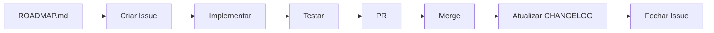

# 🎯 Sistema de Gerenciamento de Tarefas - LegendAI

Sistema integrado para gerenciar tarefas do projeto usando **GitHub Issues** + **VSCode**.

## 🚀 Stack de Ferramentas

### 1. GitHub Issues (Jira Alternative)
- ✅ Gratuito e ilimitado
- ✅ Integrado com o repositório
- ✅ Suporta labels, milestones, assignees
- ✅ Kanban board (GitHub Projects)
- ✅ CLI poderosa (`gh`)

### 2. VSCode Extension: GitHub Pull Requests and Issues
- ✅ Criar/visualizar issues direto no VSCode
- ✅ Sincronizar com GitHub automaticamente
- ✅ Shortcuts de teclado
- ✅ Integração com Copilot

### 3. Scripts de Automação
- ✅ Criar issues automaticamente do ROADMAP
- ✅ Sincronizar estado das tasks
- ✅ Copilot pode criar/atualizar issues via comandos

---

## 📦 Setup Inicial (Apenas uma vez)

### 1. Instalar GitHub CLI
```bash
brew install gh
gh auth login
```

### 2. Instalar Extensão VSCode
```bash
code --install-extension GitHub.vscode-pull-request-github
```

Ou pelo VSCode:
1. `Cmd+Shift+X` (Extensions)
2. Buscar: "GitHub Pull Requests and Issues"
3. Instalar

### 3. Configurar Extensão
1. `Cmd+Shift+P` → "GitHub: Sign In"
2. Autorizar no navegador
3. Pronto! ✅

### 4. Criar Labels e Milestones
```bash
chmod +x .github/scripts/sync-roadmap-to-issues.sh
./.github/scripts/sync-roadmap-to-issues.sh
```

---

## 🎯 Como Usar no Dia a Dia

### Opção 1: VSCode Extension (RECOMENDADO)
```
1. Abrir sidebar do GitHub (ícone GitHub na barra lateral)
2. Ver todas as issues do projeto
3. Clicar em "+" para criar nova issue
4. Ou: Cmd+Shift+P → "GitHub Issues: Create Issue"
```

**Shortcuts:**
- `Cmd+Shift+P` → "GitHub Issues: Focus on Issues View"
- Clicar na issue para ver detalhes
- Marcar checkbox direto na interface

### Opção 2: CLI (Para automação)
```bash
# Criar issue
gh issue create \
  --title "Implementar validação de API key" \
  --body "Adicionar validação em tempo real no Step 2" \
  --label "🔥 crítico" \
  --milestone "SPRINT 1 - Crítico"

# Listar issues abertas
gh issue list

# Ver issue específica
gh issue view 1

# Fechar issue
gh issue close 1

# Reabrir issue
gh issue reopen 1
```

### Opção 3: Criar TODAS as issues do ROADMAP automaticamente
```bash
python3 .github/scripts/create-issues-from-roadmap.py
```

Isso vai:
1. Ler o `docs/ROADMAP.md`
2. Extrair todas as tarefas
3. Criar issues com labels e milestones corretos
4. Adicionar checklists

---

## 🤖 Integração com Copilot

### Como o Copilot pode ajudar:

#### 1. Criar issues via prompt:
```
@workspace Crie uma issue no GitHub para implementar validação de API key,
com label crítico e milestone SPRINT 1
```

#### 2. Atualizar issues:
```
@workspace Marque a issue #5 como concluída
```

#### 3. Listar próximas tarefas:
```
@workspace Quais são as próximas 3 issues críticas do projeto?
```

#### 4. Gerar código baseado em issue:
```
@workspace Implemente a solução descrita na issue #3
```

---

## 📊 GitHub Projects (Kanban Board)

### Criar Project Board:
1. Ir em: https://github.com/TiagoStryke/LegendAI/projects
2. Clicar "New project"
3. Escolher "Board" template
4. Nomear: "LegendAI Development"
5. Adicionar views:
   - **Backlog** (todas as issues)
   - **Sprint Atual** (filter: milestone)
   - **Por Prioridade** (group by: label)

### Colunas sugeridas:
- 📋 **Backlog** - Issues não iniciadas
- 🚧 **In Progress** - Trabalhando agora
- 👀 **Review** - Aguardando revisão
- ✅ **Done** - Concluído

### Automação:
- Issue criada → Backlog
- Issue atribuída → In Progress
- PR aberto → Review
- PR merged → Done

---

## 📁 Estrutura de Arquivos

```
legendai/
├── docs/                           # 📚 Documentação
│   ├── ROADMAP.md                 # Plano mestre
│   ├── CHANGELOG.md               # Histórico
│   ├── REFACTORING-PLAN.md        # Detalhes técnicos
│   ├── DEPENDENCIES-UPDATE-PLAN.md # Atualização de deps
│   └── EXECUTIVE-SUMMARY.md        # Resumo executivo
│
├── .github/
│   └── scripts/
│       ├── sync-roadmap-to-issues.sh        # Setup inicial
│       ├── create-issues-from-roadmap.py    # Criar issues
│       └── README.md                        # Este arquivo
│
└── [código do projeto]
```

---

## 🎨 Labels Disponíveis

| Label | Uso | Cor |
|-------|-----|-----|
| 🔥 crítico | Resolver AGORA | Vermelho |
| 🔴 alta prioridade | Próxima sprint | Laranja |
| 🟠 média prioridade | Médio prazo | Amarelo |
| 🟡 baixa prioridade | Backlog | Verde |
| 💰 monetização | Features pagas | Roxo |
| 📱 expansão | Apps/Extensões | Azul |
| 🔧 técnico | Infra/Deps | Cinza |
| 📈 marketing | SEO/Social | Rosa |
| 🐛 bug | Correções | Vermelho escuro |
| ✨ enhancement | Melhorias | Azul claro |

---

## 🎯 Milestones (Sprints)

| Milestone | Duração | Objetivo |
|-----------|---------|----------|
| **SPRINT 1 - Crítico** | 1 semana | Timeout + Validação + Refatoração |
| **SPRINT 2 - Alta** | 1 semana | Rate limiting + TMDb |
| **SPRINT 3 - Média** | 2 semanas | Múltiplos formatos + Upload |
| **SPRINT 4 - Features** | 2 semanas | i18n + Multi-idioma |
| **SPRINT 5+ - Monetização** | 4-6 semanas | Auth + Pagamentos |

---

## 🔄 Workflow de Desenvolvimento



### Passo a passo:
1. **Escolher próxima issue** (VSCode sidebar ou `gh issue list`)
2. **Criar branch** (`git checkout -b fix/nome-da-issue`)
3. **Implementar** (seguir checklist da issue)
4. **Testar** (`npm run dev`, `npm run build`)
5. **Commit** (mensagem descritiva referenciando issue: `fix: resolver timeout #1`)
6. **Push** e abrir PR
7. **Merge** quando aprovado
8. **Atualizar docs** (CHANGELOG.md)
9. **Fechar issue** (automaticamente se commit tiver `closes #1`)

---

## 💡 Dicas Profissionais

### 1. Referenciar issues em commits:
```bash
git commit -m "fix: resolver timeout do Vercel

Implementa processamento chunk-por-chunk para evitar
timeout de 300s do Vercel.

Closes #1"
```

### 2. Criar issues rapidamente:
```bash
gh issue create --web  # Abre no navegador
```

### 3. Buscar issues:
```bash
gh issue list --label "🔥 crítico"
gh issue list --milestone "SPRINT 1 - Crítico"
gh issue list --assignee @me
```

### 4. Templates de issue:
Criar `.github/ISSUE_TEMPLATE/bug_report.md` e `feature_request.md`

### 5. VSCode Workspace:
Adicionar ao `.vscode/settings.json`:
```json
{
  "githubIssues.queries": [
    {
      "label": "🔥 Crítico",
      "query": "is:open label:\"🔥 crítico\""
    },
    {
      "label": "Meu Sprint",
      "query": "is:open milestone:\"SPRINT 1 - Crítico\" assignee:@me"
    }
  ]
}
```

---

## 🆘 Troubleshooting

### "gh: command not found"
```bash
brew install gh
```

### "gh auth: not authenticated"
```bash
gh auth login
```

### "Extensão VSCode não funciona"
1. Recarregar VSCode: `Cmd+Shift+P` → "Reload Window"
2. Sign out e sign in novamente
3. Verificar: `Cmd+Shift+P` → "GitHub: Sign In"

### "Python script não funciona"
```bash
python3 --version  # Deve ser 3.6+
python3 .github/scripts/create-issues-from-roadmap.py
```

---

## 🎉 Pronto para usar!

Agora você tem um sistema profissional de gerenciamento de tarefas:
- ✅ GitHub Issues = seu Jira
- ✅ VSCode Extension = interface rápida
- ✅ CLI = automação poderosa
- ✅ Scripts = sincronizar com ROADMAP
- ✅ Copilot = criar/gerenciar issues via prompt

**Próxima ação:**
```bash
# 1. Setup inicial
./.github/scripts/sync-roadmap-to-issues.sh

# 2. Criar todas as issues do ROADMAP
python3 .github/scripts/create-issues-from-roadmap.py

# 3. Abrir VSCode e ver suas issues
code .
# Cmd+Shift+P → "GitHub Issues: Focus on Issues View"
```

🚀 Bom desenvolvimento!
