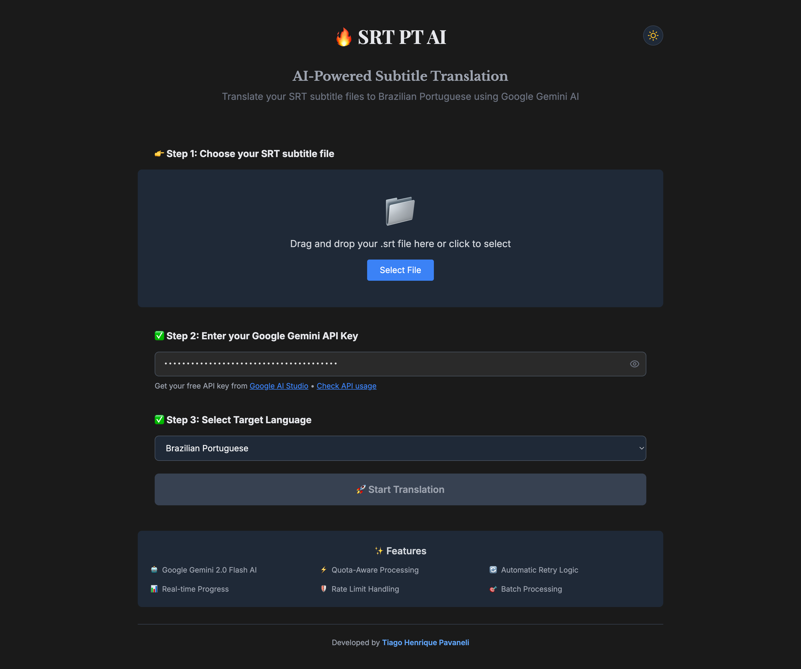

<div align="center">



# 🎬 SRT PT AI Translator

### Tradutor de Legendas Inteligente com IA

Traduza arquivos de legenda SRT para Português Brasileiro com precisão e naturalidade usando o poder da Inteligência Artificial.

[](https://nextjs.org/)
[](https://www.typescriptlang.org/)
[](https://vercel.com)
[](./LICENSE)

[Demo ao Vivo](https://srt-pt-ai.vercel.app) • [Reportar Bug](https://github.com/TiagoStryke/srt-pt-ai/issues) • [Solicitar Feature](https://github.com/TiagoStryke/srt-pt-ai/issues)

</div>

---

## 🌟 Características

- 🤖 **IA Avançada**: Utiliza Google Gemini para traduções precisas e naturais
- ⚡ **Processamento em Chunks**: Divide legendas longas em partes otimizadas
- 📊 **Barra de Progresso**: Acompanhe o progresso da tradução em tempo real
- 🎨 **Interface Moderna**: Design responsivo com tema claro/escuro
- 🔄 **Retry Automático**: Sistema inteligente de retry em caso de falhas
- 📝 **Preservação de Formato**: Mantém timestamps e formatação original
- 🌐 **Sem Servidor**: Deploy serverless na Vercel para escalabilidade infinita

## 🚀 Demo

Acesse a aplicação em produção: **[srt-pt-ai.vercel.app](https://srt-pt-ai.vercel.app)**

## 📋 Pré-requisitos

Antes de começar, você precisará ter instalado:

- [Node.js](https://nodejs.org/) (versão 18 ou superior)
- [npm](https://www.npmjs.com/) ou [yarn](https://yarnpkg.com/)
- Uma chave de API do [Google AI Studio](https://aistudio.google.com/)

## 🛠️ Instalação

### 1. Clone o repositório

```bash
git clone https://github.com/TiagoStryke/srt-pt-ai.git
cd srt-pt-ai
```

### 2. Instale as dependências

```bash
npm install
# ou
yarn install
```

### 3. Configure as variáveis de ambiente

Crie um arquivo `.env.local` na raiz do projeto:

```env
GOOGLE_GENERATIVE_AI_API_KEY=sua_chave_api_aqui
```

> 💡 **Dica**: Obtenha sua chave gratuita em [Google AI Studio](https://aistudio.google.com/)

### 4. Execute o projeto localmente

```bash
npm run dev
# ou
yarn dev
```

Acesse [http://localhost:3000](http://localhost:3000) no seu navegador.

## 📁 Estrutura do Projeto

```
srt-pt-ai/
├── app/                      # Next.js App Router
│   ├── api/                  # API Routes
│   │   └── route.ts         # Endpoint de tradução
│   ├── layout.tsx           # Layout global
│   ├── page.tsx             # Página principal
│   ├── globals.css          # Estilos globais
│   └── custom.css           # Estilos customizados
├── components/               # Componentes React
│   ├── Form.tsx             # Formulário de upload
│   ├── TranslationProgress.tsx  # Barra de progresso
│   ├── ThemeToggle.tsx      # Alternador de tema
│   ├── Timestamp.tsx        # Componente de timestamp
│   └── DebugConsole.tsx     # Console de debug
├── lib/                      # Funções utilitárias
│   ├── client.ts            # Funções do cliente
│   └── srt.ts               # Parser e processador de SRT
├── fonts/                    # Fontes customizadas
│   ├── index.ts             # Exportação de fontes
│   └── RoaldDahlWonkyBold.woff
├── public/                   # Arquivos estáticos
│   ├── favicon.ico
│   ├── icon.png
│   └── fire-chicken.png
├── types.ts                  # Definições de tipos TypeScript
├── next.config.js           # Configuração do Next.js
├── vercel.json              # Configuração do Vercel
├── tailwind.config.ts       # Configuração do Tailwind CSS
└── tsconfig.json            # Configuração do TypeScript
```

## 🎯 Como Usar

1. **Acesse a aplicação** em [srt-pt-ai.vercel.app](https://srt-pt-ai.vercel.app) ou execute localmente
2. **Faça upload** do seu arquivo `.srt` clicando na área de drop ou arrastando o arquivo
3. **Aguarde** enquanto a IA traduz suas legendas (acompanhe o progresso!)
4. **Baixe** o arquivo traduzido automaticamente quando concluir

### Exemplo de Uso via API

```javascript
const formData = new FormData();
formData.append('file', srtFile);
formData.append('targetLanguage', 'pt-BR');

const response = await fetch('/api', {
  method: 'POST',
  body: formData,
});

// Processar stream de eventos
const reader = response.body.getReader();
const decoder = new TextDecoder();

while (true) {
  const { done, value } = await reader.read();
  if (done) break;
  
  const chunk = decoder.decode(value);
  const lines = chunk.split('\n');
  
  for (const line of lines) {
    if (line.startsWith('data: ')) {
      const data = JSON.parse(line.slice(6));
      console.log('Progresso:', data.percentage);
    }
  }
}
```

## 🏗️ Tecnologias Utilizadas

### Frontend
- **[Next.js 14](https://nextjs.org/)** - Framework React com App Router
- **[React 18](https://react.dev/)** - Biblioteca para interfaces
- **[TypeScript](https://www.typescriptlang.org/)** - Tipagem estática
- **[Tailwind CSS](https://tailwindcss.com/)** - Framework CSS utilitário

### Backend / IA
- **[Google Gemini](https://ai.google.dev/)** - Modelo de IA para tradução
- **[AI SDK](https://sdk.vercel.ai/)** - SDK da Vercel para IA
- **[Tiktoken](https://github.com/openai/tiktoken)** - Tokenização de texto

### Deploy
- **[Vercel](https://vercel.com/)** - Plataforma de deploy e hospedagem

## ⚙️ Configuração Avançada

### Variáveis de Ambiente

| Variável | Descrição | Obrigatória |
|----------|-----------|-------------|
| `GOOGLE_GENERATIVE_AI_API_KEY` | Chave de API do Google Gemini | ✅ Sim |
| `OPTIONS_ALLOWLIST` | Lista de origens permitidas (CORS) | ❌ Não |
| `VERCEL_URL` | URL do deploy (auto-configurada) | ❌ Não |

### Configuração do Tiktoken (WASM)

O projeto usa `tiktoken` para tokenização, que requer arquivos WebAssembly. A configuração já está otimizada no `next.config.js`:

```javascript
experimental: {
  outputFileTracingIncludes: {
    '/api': ['./node_modules/tiktoken/**/*'],
  },
}
```

### Limites e Quotas

- **Tamanho máximo de arquivo**: Sem limite definido
- **Tokens por chunk**: 400 tokens (otimizado para Gemini)
- **Retry automático**: 3 tentativas com backoff exponencial
- **Timeout**: 60 segundos por chunk


### Tradução lenta

**Solução**: O tempo varia conforme o tamanho do arquivo. Arquivos grandes são processados em chunks para melhor performance.

## 🤝 Contribuindo

Contribuições são sempre bem-vindas! Siga estes passos:

1. Fork o projeto
2. Crie uma branch para sua feature (`git checkout -b feature/AmazingFeature`)
3. Commit suas mudanças (`git commit -m 'Add some AmazingFeature'`)
4. Push para a branch (`git push origin feature/AmazingFeature`)
5. Abra um Pull Request

### Diretrizes

- ✅ Mantenha o código limpo e bem documentado
- ✅ Adicione testes quando aplicável
- ✅ Siga as convenções de código existentes
- ✅ Atualize a documentação se necessário

## 📜 Licença

Este projeto está sob a licença MIT. Veja o arquivo [LICENSE](./LICENSE) para mais detalhes.

## 👨‍💻 Autor

**Tiago Pavaneli**

- GitHub: [@TiagoStryke](https://github.com/TiagoStryke)
- LinkedIn: [Tiago Pavaneli](https://www.linkedin.com/in/tiagopavaneli/)

## 🙏 Agradecimentos

- [Google AI](https://ai.google.dev/) pelo modelo Gemini
- [Vercel](https://vercel.com/) pela plataforma de deploy
- [Next.js](https://nextjs.org/) pelo framework incrível
- Todos os contribuidores que ajudaram a melhorar este projeto

## 📞 Suporte

Encontrou um bug ou tem uma sugestão? 

- 🐛 [Reporte um bug](https://github.com/TiagoStryke/srt-pt-ai/issues)
- 💡 [Sugira uma feature](https://github.com/TiagoStryke/srt-pt-ai/issues)
- 📧 [Entre em contato](mailto:tiagostryke@gmail.com)

---

<div align="center">

**[⬆ Voltar ao topo](#-srt-pt-ai-translator)**

[Tiago Pavaneli](https://github.com/TiagoStryke)

</div>


